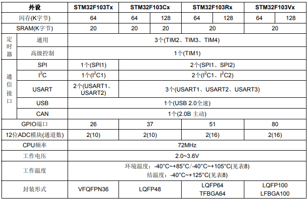

# [STM32F103](https://github.com/SoCXin/STM32F103)

* [ST](https://www.st.com/zh/): [Cortex-M3](https://github.com/SoCXin/Cortex)
* [L3R4](https://github.com/SoCXin/Level): 72 MHz x 1.25 DMIPS/MHz (177CoreMark)

## [简介](https://github.com/SoCXin/STM32F103/wiki)

[STM32F103](https://github.com/SoCXin/STM32F103) 具有高达1MB的Flash、电机控制、USB和CAN

### 关键特性

* 9 个通信接口 (2xI2C,3xUSART,2xSPI,CAN2.0B,USB2.0)
* Temperature sensor

#### 封装规格

* LQFP48 (7×7mm)
* LQFP64 (10×10mm)
* LQFP100 (14×14mm)
* LQFP144 (20×20mm)

### [资源收录](https://github.com/SoCXin)

* [参考资源](src/)
* [参考文档](docs/)
* [参考工程](project/)

### [选型建议](https://github.com/SoCXin)

[STM32F103](https://github.com/SoCXin/STM32F103) 该系列的规格型号也是最全的，按封装和存储容量有29个规格配置,兼容系列包括：

* STM32F100 - 24 MHz CPU，具有电机控制和CEC功能
* STM32F101 - 36 MHz CPU，具有高达1MB的Flash
* STM32F102 – 48 MHz CPU具备USB FS
* STM32F103 - 72 MHz，具有高达1MB的Flash、电机控制、USB和CAN
* STM32F105/107 - 72 MHz CPU，具有以太网MAC、CAN和USB 2.0 OTG

###  [探索芯世界 www.SoC.xin](http://www.SoC.Xin)
