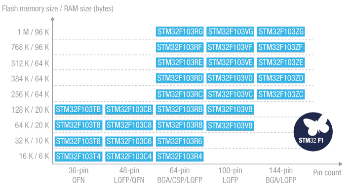

# [STM32F103](https://github.com/sochub/STM32F103)

 

####  qitas@qitas.cn

#### 父级：[STM32F1](https://github.com/sochub/STM32F1) 
#### 归属：[Cortex M3](https://github.com/sochub/CM3) 

## [简介](https://github.com/sochub/STM32F103/wiki)

STM32F103 devices use the Cortex-M3 core, with a maximum CPU speed of 72 MHz. The portfolio covers from 16 Kbytes to 1 Mbyte of Flash with motor control peripherals, USB full-speed interface and CAN. 

 

## [组成](https://github.com/sochub/STM32F103)

#### [文档](docs/)

#### [资源](src/)

#### [工程](project/)

--- 

### [收录型号](https://github.com/sochub/STM32F103)

- [STM32F103C](https://github.com/sochub/STM32F103C) 

- [STM32F103R](https://github.com/sochub/STM32F103R) 

- [STM32F103V](https://github.com/sochub/STM32F103R) 

- [STM32F103Z](https://github.com/sochub/STM32F103Z) 

##  [SoC开发平台](http://www.qitas.cn)  

