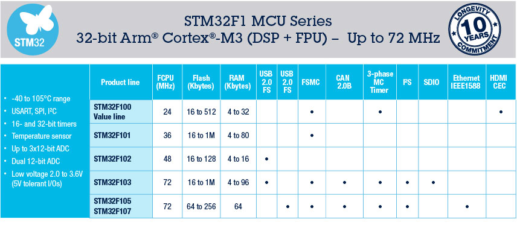

# [STM32F103](https://github.com/SoCXin/STM32F103)

* [ST](https://www.st.com/zh/): [Armv7-M:Cortex-M3](https://github.com/SoCXin/Cortex)
* [L3R4](https://github.com/SoCXin/Level): 72 MHz x 1.25 DMIPS/MHz, [1.50 CoreMark/MHz](https://www.eembc.org/coremark/scores.php)

## [简介](https://github.com/SoCXin/STM32F103/wiki)

[STM32F103](https://github.com/SoCXin/STM32F103) 具有高达1MB的Flash、电机控制、USB和CAN

### 关键特性

* 最多 9 个通信接口 (2xI2C,3xUSART,2xSPI,CAN2.0B,USB2.0)
* 29个规格配置
* 大量开源工程 (Bluepill)

### [资源收录](https://github.com/SoCXin)

* [参考资源](src/)
* [参考文档](docs/)
* [参考工程](project/)

### [选型建议](https://github.com/SoCXin)

[STM32F103](https://github.com/SoCXin/STM32F103) 借助于开源方案非常适合原型验证和小样开发，配置全面能满足各种常用场景，各种替换方案也十分普及，是MCU的一个时代标杆产品

* STM32F103，具有高达1MB的Flash、电机控制、USB和CAN
* STM32F105/107，具有以太网MAC、CAN和USB 2.0 OTG

#### 封装规格

* LQFP48 (7×7mm)
* LQFP64 (10×10mm)
* LQFP100 (14×14mm)

### [探索芯世界 www.SoC.xin](http://www.SoC.Xin)
